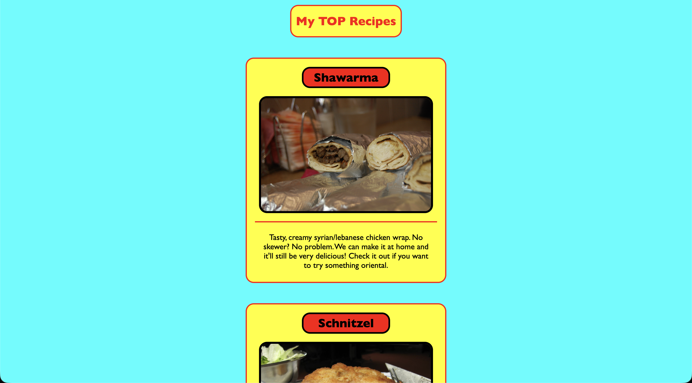

# top-recipes

## About this Project

This is my very first project on Web-Development, it was made first with pure HTML and later on with CSS.

Inside are also my own recipes from past experiences and experiments. I made them a year ago and I didn't want them to go to waste: So I decided to post them here. Feel free to suggest some improvements or if you may find some bugs. I hope those recipes are going to be worth to taste!

This project is a task from The Odin Project, a structured full stack development course. You can learn at your own pace and it starts from 0 to getting employed. I highly recommend taking this course.
More on [The Odin Project](https://theodinproject.com/).

## Live Demo

Visit the page online: [top-recipes](https://axhis8.github.io/top-recipes/)

## Features

- Images, Instructions & Ingredients for the recipes
- Page navigation
- CSS Design

## Built With

- HTML5
- CSS3

## What I Learned

- Image betting
- Lists & Links in HTML
- Basics of CSS like changing colors, fonts, etc.
- Uploading repos on Github
- How to commit on Git

## Screenshot

